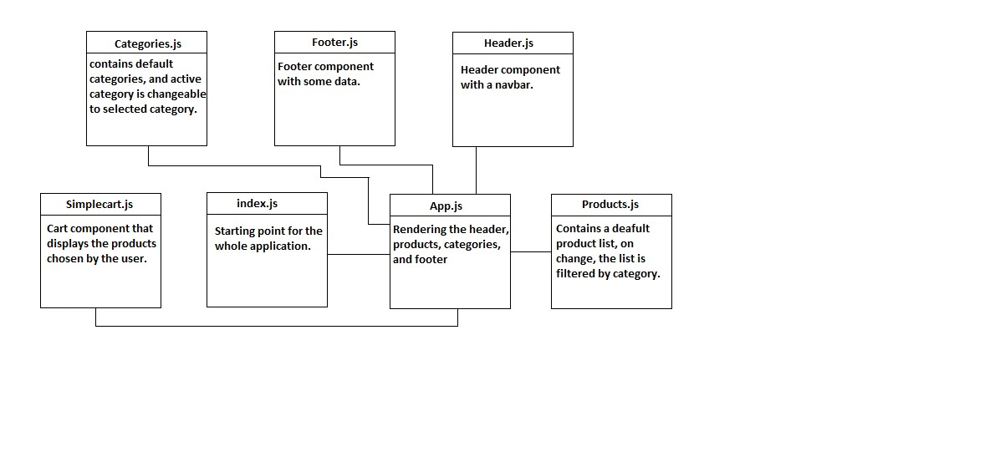

# storefront

An implementation of a commerce storefront using React with Redux.

The user expects to see a list of available product categories in the store so that the user can easily browse products. The user can choose a category and see a list of all available products matching that category.

## Technologies

- React
- Redux
- Material UI

## PreRequiesites:

- npm i 

To start the application type in the terminal : `npm start`

For testing type in the terminal : `npm test`

## UML

